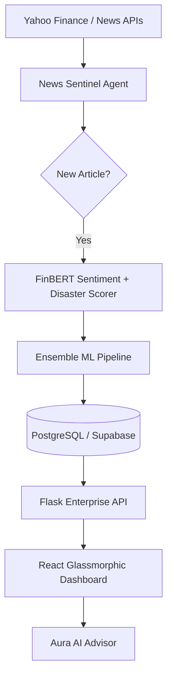

# 🌌 Aura Finance — Enterprise AI Wealth Copilot

[](https://vite.dev/)
[](https://react.dev/)
[](https://www.python.org/)
[](https://www.postgresql.org/)
[](https://deepmind.google/technologies/gemini/)

Aura Finance is an enterprise-grade quantitative financial intelligence platform. It combines a **5-model Ensemble ML Pipeline**, **FinBERT Sentiment Analysis**, and **Real-time News Sentinel** to provide professional-grade market forecasts and portfolio optimization.

---

## 🚀 Key Enterprise Features

### 🧠 Hybrid Ensemble ML Engine
Our proprietary prediction engine combines five distinct architectures for robust forecasting:
- **Amazon Chronos-T5 (35%)**: Zero-shot foundation model for time-series.
- **PyTorch Transformer (20%)**: Captures long-range market dependencies.
- **XGBoost (20%)**: Gradient boosted trees for technical indicator analysis.
- **LightGBM (15%)**: Leaf-wise boosting for fine-grained price movement.
- **LSTM RNN (10%)**: Recurrent neural network for sequential memory.

### 📰 24/7 News Sentinel Agent
- **FinBERT Sentiment**: Analyzes real-time news headlines using ProsusAI's FinBERT.
- **Disaster Risk Detection**: Scans for 23 categories of market-shaking events (wars, crashes, scams).
- **Auto-Reprediction**: Detects *any* new headline and immediately triggers a full ensemble re-forecast.

### 📊 Modern Portfolio Theory (MPT)
- **Monte Carlo Optimizer**: Simulates 5,000+ portfolios to find the **Maximum Sharpe Ratio**.
- **Live Rebalancing**: Real-time weight adjustment suggestions based on historical covariance and risk-free rates.

### 🌐 Market Intelligence Modules
- **Enterprise Screener**: Multi-factor filtering (AI Sentiment, Risk Score, P/E Ratio, Market Cap).
- **Global Macro View**: Real-time tracking of S&P 500, Nasdaq, Nikkei, USD/INR, and Bitcoin.
- **Aura AI Advisor**: Hyper-contextual strategy guidance powered by Gemini 1.5 Flash.

---

## 🛠 Tech Stack

### Frontend
- **Framework**: React 19 with TypeScript
- **State Management**: Context API
- **Visuals**: Recharts (Financial Charts), Lucide (Icons)
- **Styling**: Glassmorphic Vanilla CSS (Hardware Accelerated)

### Backend
- **Framework**: Flask (Python 3.11)
- **Database**: PostgreSQL / Supabase with JSONB storage
- **ML/DL**: PyTorch, XGBoost, LightGBM, Chronos, Transformers (HuggingFace)
- **APM**: Custom Latency & Model Drift Monitoring

---

## 🏗 System Architecture



---

## 💻 Getting Started

### Prerequisites
- Python 3.11+
- Node.js 20+
- PostgreSQL (or Supabase URL)
- Google Gemini API Key

### Backend Setup
1. `cd backend`
2. `pip install -r requirements.txt`
3. Create a `.env` in the root:
   ```env
   DATABASE_URL=your_postgres_url
   VITE_GEMINI_API_KEY=your_gemini_key
   ```
4. `python app.py`

### Frontend Setup
1. `npm install`
2. `npm run dev`

---

## 🗺 Project Roadmap
- [ ] **Multi-Currency Support**: Expanding beyond Nifty 50 to global stock exchanges.
- [ ] **Push Notifications**: Real-time browser/mobile alerts for high-risk disaster scores.
- [ ] **Tax Harvesting Engine**: Automated suggestions for tax-efficient rebalancing.
- [ ] **Advanced Backtesting Suite**: Visual historical performance analysis for all ensemble models.

---

## 🛡 Security & Reliability
- **CORS Protection**: Restricted origin access for enterprise deployment.
- **Global Exception Handling**: Structured JSON error reporting.
- **Automated Testing**: Integrated unit tests for API stability.
- **Caching**: LRU-based performance layer for market data.

---

## 📄 License
Distributed under the MIT License. See `LICENSE` for more information.

---

<div align="center">
  Built with ❤️ for the next generation of quantitative investors.
</div>
