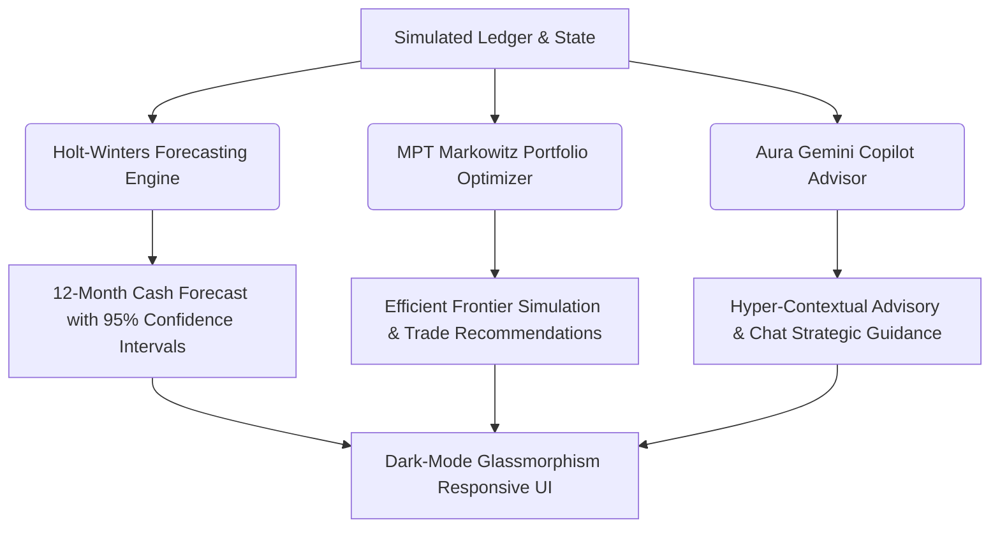

# 🌌 AuraFinance — AI Wealth Copilot & Predictive Dashboard

<div align="center">
  
  [](https://vite.dev/)
  [](https://react.dev/)
  [](https://www.typescriptlang.org/)
  [](https://deepmind.google/technologies/gemini/)

</div>

---

## 📌 The Problem
Traditional consumer finance apps suffer from critical limitations:
1. **Backward-Looking Data:** They display static charts of *past* transactions but fail to project cash positions into the future.
2. **Suboptimal Asset Allocation:** Users manually distribute cash across accounts without mathematical backing, leading to inefficient risk-adjusted returns (sub-optimal Sharpe Ratios).
3. **Generic & Static Advice:** Traditional advisors are expensive, and generic savings tips fail to adjust dynamically to a user's active transactional realities and risk levels.
4. **Poor UI Adaptability:** Multi-column financial interfaces are hard to navigate on mobile, resulting in friction and low engagement.

---

## 💡 The Solution: AuraFinance
AuraFinance is an advanced personal wealth copilot built to solve these issues. It combines quantitative mathematical engines with generative AI inside a responsive, glassmorphic layout:



- **🔮 Time-Series Projection:** Uses a **Holt-Winters Seasonal Additive Model** to project cash reserves 12 months ahead, showing confidence bands so users can identify cash flow bottlenecks *before* they occur.
- **📈 Portfolio Optimization:** Implements **Mean-Variance Optimization** directly in TypeScript. It runs a Monte Carlo simulation ($1,200+$ portfolios) to locate the Maximum Sharpe Ratio portfolio and suggest rebalancing trades.
- **💬 Strategic AI Copilot:** Powered by Google's **Gemini AI**, this conversational strategist ingests active ledger states, forecasting outputs, and optimal portfolio data to give hyper-customized savings challenges and analysis.
- **⚡ Responsive Glassmorphic Layout:** Built with a custom vanilla CSS system that adapts to mobile (bottom tab navigation), tablet, and desktop (multi-column widgets) with hardware-accelerated animations.

---

## 🌟 Key Features

*   **📊 Unified Dashboard:** Live tracking of Net Worth, Liquidity Runway, Asset-Liability Spread, and Monthly Spending Velocity.
*   **✏️ Interactive Ledger:** Filter transactions by category, search logs, and manually add transactions with instant state updates.
*   **📐 Math Visualizer Sliders:** Fine-tune Holt-Winters smoothing constants ($\alpha$, $\beta$, $\gamma$) and see the forecasting model adapt in real-time.
*   **🔄 Single-Tap Portfolio Rebalancer:** Executing suggestions instantly triggers asset trades, updating the ledger history and cash balances.
*   **🔐 Private Keys:** Store your Gemini API Key safely in browser `localStorage` or load from `.env.local` variables.

---

## 📱 Responsive Layout Specifications

AuraFinance utilizes a custom-engineered breakpoint architecture to render beautifully on any screen size:

| Device Class | Breakpoint | Layout Grid | Key UI Adaptations |
| :--- | :--- | :--- | :--- |
| **Desktop** | $> 1024\text{px}$ | 3-column / Multi-column | Large composed charts, side-by-side rebalance suggestions, settings modals. |
| **Tablet** | $640\text{px} - 1024\text{px}$ | 2-column to 1-column stack | Asset distributions stack above transactions, charts scale to full width. |
| **Mobile** | $< 640\text{px}$ | 1-column fluid | **Fixed bottom tab bar** with thumb-friendly navigation, sliders expand full-width. |

---

## 📐 Mathematical Engines

<details>
<summary><b>🔮 Holt-Winters Exponential Cash-Flow Smoothing</b></summary>

Predicts future cash balances $Y_{t+h}$ by decomposing historical ledger balances into Level ($L_t$), Trend ($T_t$), and Seasonal ($S_t$) indicators:

$$\text{Level: } L_t = \alpha (Y_t - S_{t-s}) + (1 - \alpha)(L_{t-1} + T_{t-1})$$
$$\text{Trend: } T_t = \beta (L_t - L_{t-1}) + (1 - \beta)T_{t-1}$$
$$\text{Seasonal: } S_t = \gamma (Y_t - L_{t-1} - T_{t-1}) + (1 - \gamma)S_{t-s}$$
$$\text{Forecast: } \hat{Y}_{t+h} = L_t + hT_t + S_{t+h-s}$$
</details>

<details>
<summary><b>📊 Modern Portfolio Theory (Sharpe Maximizer)</b></summary>

Solves the Markowitz optimization problem to calculate optimal weights vector $\mathbf{w}$ maximizing the Sharpe Ratio ($SR$):

$$\text{Maximize: } SR = \frac{\mathbf{w}^T \boldsymbol{\mu} - R_f}{\sqrt{\mathbf{w}^T \boldsymbol{\Sigma} \mathbf{w}}}$$
$$\text{Subject to: } \sum_{i=1}^n w_i = 1, \quad w_i \ge 0$$

Where $\boldsymbol{\mu}$ represents expected returns, $\boldsymbol{\Sigma}$ is the covariance matrix, and $R_f$ is the risk-free rate.
</details>

---

## 💻 Setup & Development

### Local Installation
1. **Clone the repository:**
   ```bash
   git clone https://github.com/YOUR_USERNAME/Aura-Finance.git
   cd Aura-Finance
   ```
2. **Install dependencies:**
   ```bash
   npm install --legacy-peer-deps
   ```
3. **Run local dev server:**
   ```bash
   npm run dev
   ```
   *Navigate your browser to `http://localhost:5173`.*

4. **Production Build:**
   ```bash
   npm run build
   ```

---

## ⚙️ Generative AI Integration

To activate the **Aura Copilot** AI advisor:
1. Click the **Settings** (gear) icon in the top right header.
2. Paste your **Gemini API Key** (starts with `AIzaSy...`).
3. Press **Save Changes**. (The key will persist securely in browser cache).
4. *If no key is configured, Aura will automatically run in local sandbox model mode, simulating advice using offline rule-based financial models.*

---

Built with 💙 by **Akshith Nallaginnela** for the Elite Coders Open Source Hackathon 2026.
