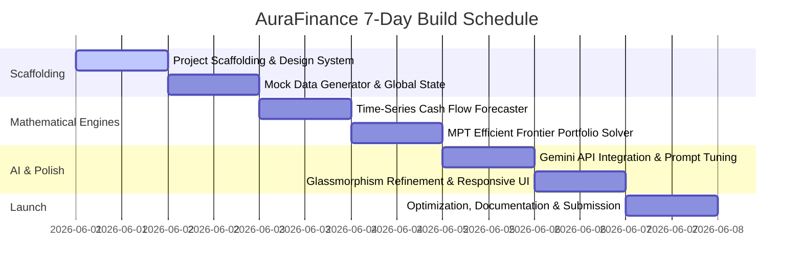

# 🌌 AuraFinance — AI Wealth Copilot & Predictive Dashboard

AuraFinance is an advanced personal wealth platform built for the **Elite Coders Open Source Hackathon**. By blending modern quantitative finance algorithms with generative AI, AuraFinance helps users forecast future cash flows, optimize their investment asset allocation using Modern Portfolio Theory, and interact with a highly personalized AI Financial Strategist.

The entire interface is built using a custom-engineered, dark-mode-first, glassmorphism design system to deliver a premium, state-of-the-art consumer finance experience.

---

## 🌟 Key Features

*   **📊 Dynamic Wealth Dashboard:** A unified view of net worth, liquidity ratios, asset-to-liability spreads, and transaction velocity.
*   **🔮 Time-Series Cash Flow Forecasting:** Uses mathematical models (Holt-Winters Exponential Smoothing) to project cash reserves, savings rates, and potential financial bottlenecks 12 months into the future.
*   **📈 MPT Portfolio Optimizer:** Implements Mean-Variance Optimization (Markowitz Model) directly in TypeScript, calculating the Efficient Frontier and proposing trade updates to maximize your Sharpe Ratio.
*   **💬 Aura Copilot (Generative AI Advisor):** A premium chat interface powered by Gemini, trained to analyze simulated ledger data and offer structured savings challenges, market analysis, and tailored cash-flow recommendations.
*   **⚡ Premium Glassmorphic Design:** Customized vanilla CSS dashboard leveraging deep slates, emerald overlays, responsive flex grids, and smooth hardware-accelerated micro-animations.

---

## 🚀 7-Day Hackathon Roadmap



*   **📅 Day 1 (Today):** Scaffolding the React + Vite + TS framework. Establishing `index.css` design system token variables (colors, typography, blur strengths). Creating repository and initial commit.
*   **📅 Day 2:** Creating the financial ledger generator (producing 6 months of historical salary, bills, and discretionary spending) and establishing the context state manager.
*   **📅 Day 3:** Designing the mathematical cash-flow forecaster using Holt-Winters seasonal math. Integrating area charts for forecast confidence intervals.
*   **📅 Day 4:** Implementing the Mean-Variance Optimization mathematics. Generating random portfolios for the Efficient Frontier scatter plot, and calculating capital allocation lines.
*   **📅 Day 5:** Integrating the `@google/generative-ai` SDK. Designing the context-injected prompt layout to send analytics directly to Gemini for hyper-customized advisor recommendations.
*   **📅 Day 6:** Fine-tuning desktop, tablet, and mobile responsiveness. Implementing custom glassmorphic styling, transitions, and slide animations.
*   **📅 Day 7:** Writing comprehensive setup instructions, verifying code consistency, testing cross-browser rendering, and preparing the official pull request.

---

## 🛠️ Tech Stack & Architecture

*   **Frontend:** React (Vite + TypeScript)
*   **Styling:** Vanilla CSS (Modern CSS Custom Properties for design system tokens)
*   **Charts & Visualizations:** Recharts (SVG-based responsive charting)
*   **AI Integration:** Google Gemini API Client SDK (`@google/generative-ai`)
*   **Icons:** Lucide React

---

## 📐 Mathematical Engines

### 1. Cash-Flow Forecasting (Holt-Winters seasonal model)
To project cash reserves $Y_{t+h}$, the engine decomposes raw ledger histories into Level ($L_t$), Trend ($T_t$), and Seasonal ($S_t$) indicators:

$$\text{Level: } L_t = \alpha (Y_t - S_{t-s}) + (1 - \alpha)(L_{t-1} + T_{t-1})$$
$$\text{Trend: } T_t = \beta (L_t - L_{t-1}) + (1 - \beta)T_{t-1}$$
$$\text{Seasonal: } S_t = \gamma (Y_t - L_{t-1} - T_{t-1}) + (1 - \gamma)S_{t-s}$$
$$\text{Forecast: } \hat{Y}_{t+h} = L_t + hT_t + S_{t+h-s}$$

### 2. Portfolio Optimization (Mean-Variance Theory)
To construct the optimal asset weights vector $\mathbf{w}$, the optimizer solves the Markowitz optimization problem to maximize the Sharpe Ratio ($SR$):

$$\text{Maximize: } SR = \frac{\mathbf{w}^T \boldsymbol{\mu} - R_f}{\sqrt{\mathbf{w}^T \boldsymbol{\Sigma} \mathbf{w}}}$$

$$\text{Subject to: } \sum_{i=1}^n w_i = 1, \quad w_i \ge 0$$

Where:
*   $\boldsymbol{\mu}$ represents the vector of expected asset class returns.
*   $\boldsymbol{\Sigma}$ represents the covariance matrix of asset returns.
*   $R_f$ is the risk-free rate of return (e.g., US Treasury rate).

---

## 💻 Installation & Local Development

### Prerequisites
Make sure you have Node.js (version 18 or above) installed on your system.

### Steps
1.  **Clone the repository:**
    ```bash
    git clone https://github.com/YOUR_USERNAME/YOUR_REPO_NAME.git
    cd YOUR_REPO_NAME
    ```

2.  **Install dependencies:**
    ```bash
    npm install
    ```

3.  **Run development server:**
    ```bash
    npm run dev
    ```

4.  **Open the application:**
    Open your browser and navigate to `http://localhost:5173`.

---

## 🤝 Open Source Contribution & License

AuraFinance is open-source software licensed under the [MIT License](LICENSE). Contributions, bug reports, and suggestions are welcome!

Built with 💙 by **Akshith Nallaginnela** for the Elite Coders Open Source Hackathon 2026.
